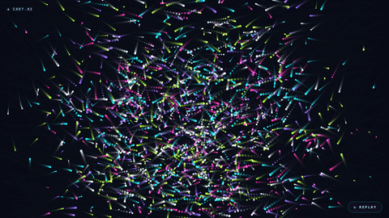

# WebGL Animation Skills

> WebGL animation skills for AI coding agents — Three.js scenes, GLSL shaders, and particle systems, off the core 2D/Lottie path.



## Install

```bash
npx skills add iart-ai/webgl-animation-skills
```

Works with Claude Code, Cursor, Codex, GitHub Copilot, and 40+ agents.

## What's included

| Skill | What it does |
|-------|--------------|
| [shader-glsl](./shader-glsl) | Write GLSL fragment shaders — gradients, noise/fbm, SDFs, domain warping, image transitions, and Three.js ShaderMaterial wiring. |
| [threejs-animation](./threejs-animation) | Build web 3D motion — scenes, camera moves, GLTF clips, instancing, scroll-linked 3D, React Three Fiber, and leak-free GPU disposal. |
| [particle-system](./particle-system) | Drive emergent motion — confetti/snow/smoke/sparks, flow fields, curl noise, connected-dot networks, and GPU `Points` shaders. |

*Need editable, repeatable motion graphics instead — exact text and numbers, brand-locked, one-click edits? [iart.ai](https://iart.ai) is the AI motion agent that produces these from a prompt or data.*

## When it activates

- You ask Claude to write a fragment shader, set up a ShaderMaterial, or build a generative GPU background.
- You're animating a Three.js / R3F scene, blending GLTF clips, or chasing a WebGL memory leak.
- You want a particle, confetti, flow-field, or constellation effect.

## Example prompts

- "Write a GLSL fragment shader for an animated aurora gradient background and wire it into Three.js."
- "Animate this GLTF model in React Three Fiber and crossfade between idle and walk clips."
- "Build a connected-dot constellation background that stays fast with 2000 particles."

## Skills

- shader-glsl
- threejs-animation
- particle-system

## Topics

`webgl` `webgl-animation` `threejs` `glsl-shaders` `particle-system` `3d-animation` `motion-graphics` `claude-skill`

## More packs

Part of a 14-pack open-source collection — install only what you need. Full hub: **[github.com/iart-ai](https://github.com/iart-ai)**

[tiktok-video-skills](https://github.com/iart-ai/tiktok-video-skills) (TikTok / Reels / Shorts) · [text-message-video-skills](https://github.com/iart-ai/text-message-video-skills) (Text-message stories) · [youtube-video-skills](https://github.com/iart-ai/youtube-video-skills) (Podcasters & YouTubers) · [ecommerce-video-skills](https://github.com/iart-ai/ecommerce-video-skills) (E-commerce sellers) · [ad-video-skills](https://github.com/iart-ai/ad-video-skills) (Brand advertisers) · [data-animation-skills](https://github.com/iart-ai/data-animation-skills) (Analysts & PMs) · [explainer-video-skills](https://github.com/iart-ai/explainer-video-skills) (Educators) · [map-animation-skills](https://github.com/iart-ai/map-animation-skills) (Vox-style maps) · [web-animation-skills](https://github.com/iart-ai/web-animation-skills) (Frontend devs) · [motion-design-skills](https://github.com/iart-ai/motion-design-skills) (Motion designers) · [kinetic-typography-skills](https://github.com/iart-ai/kinetic-typography-skills) (Kinetic type / text) · [freelance-motion-skills](https://github.com/iart-ai/freelance-motion-skills) (Freelancers & studios) · [manim-skills](https://github.com/iart-ai/manim-skills) (Math / educational)


## License

MIT

---

Built by **[iart.ai](https://iart.ai)** — the AI motion agent: describe it in a prompt — or point it at a CSV or brand kit — and get editable, on-brand motion graphics with exact text and numbers, one-click edits, and batch export.
